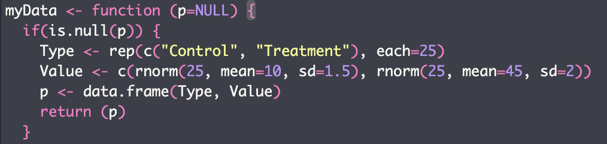

```{r setup, include=FALSE}
knitr::opts_chunk$set(echo = TRUE)
```

## Assignment 8

#### Question 1

My code did not allow for new values of the mean to be inputted without changing the function. My code was as follows:
```{r, echo=F}

```
  What prevented me from being able to change the value of the mean without changing the function was that I defined the "value" variable within the function rather than outside of the function. Because of this, the mean input was not apart of a global variable and thus couldn't be changed without changing the function.

  Aside from the first part of the assignment (ie. the above code), there weren't any major differences my code and the posted code. However, the output of this initial function is used throughout the rest of my code. So, if I wanted to change the values, I would have to change the function itself which defeats the purpose of creating the function. Also, the if statement in the code shown isn't necessary (because the argument is set to be NULL and the if statement is telling the function to run if the argument is NULL...) and also differs from the posted solutions; my code runs without it.
  Minor differences in my code just pertained to set-up. For example, the solutions did not display a summary of the ANOVA table whereas my code did. 
  
**Refer to [Weekly Assignment 2](WeeklyAssignment2.html) for my annotations providing a brief description of my code**

#### Question 2: Annotating the below code 

``` {r, include=FALSE}
  library(tidyverse)
  library(ggthemes)
```

```{r}

dryadData <- read.table("BIO1007A_Data/veysey-babbitt_data_amphibians.csv", header=TRUE, sep=",", stringsAsFactors = TRUE) 
# Loading in data from dryad
# first part is the folder in which the file is stored

dryadData$species<-factor(dryadData$species, labels=c("Spotted Salamander", "Wood Frog")) 
#creating 'labels' to use for the plot using "factor"

dryadData$treatment <- factor(dryadData$treatment, 
# creating labels to use for the plot (treatment label), also ensures that the specified labels come first 
                              levels=c("Reference",
                                       "100m", "30m"))

# The ggplot is being created now using the dryad data loaded in above 
p<- ggplot(data=dryadData, 
           aes(x=interaction(wetland, treatment), # interaction needed to group treatment and wetlands
               y=count.total.adults, fill=factor(year))) + geom_bar(position="dodge", stat="identity",  color="black") + # y="count..." assigns data to the y axis and fills the year bars with a different shade
                 # geom_bar creates the bar graph
                 # dodge preserves the vertical pos. of the graph while changing the horiz. pos.
                 # stat = identity allows the height of the bars to represent the data (be proportional)
  ylab("Number of breeding adults") + # labeling y axis
  xlab("") + # labeling x axis, this will make it so the x axis actually doesn't have a label 
  scale_y_continuous(breaks = c(0,100,200,300,400,500)) + # creating the scale for the x-axis
  scale_x_discrete(labels=c("30 (Ref)", "124 (Ref)", "141 (Ref)", "25 (100m)","39 (100m)","55 (100m)","129 (100m)", "7 (30m)","19 (30m)","20 (30m)","59 (30m)")) + # creating the scale for the y-axis. these are custom values so they must be called in as discrete 
  facet_wrap(~species, nrow=2, strip.position="right") + # this function allows the graphs to be stacked/separated by species. Without it, the species would be lumped together onto one graph separated by lines (this would be messy!). nrow specifies how many panels you want (but the max # of panels depends on the max # figures you have). strip.position orients the species label 
  theme_few() + scale_fill_grey() + # setting the bar color theme and fill color of the bars
  theme(panel.background = element_rect(fill = 'gray94', color = 'black'), legend.position="top",  legend.title= element_blank(), axis.title.y = element_text(size=12, face="bold", colour = "black"), strip.text.y = element_text(size = 10, face="bold", colour = "black")) + # setting the theme and color of the background. Setting the legend position. element_blank ensures that non-data components aren't displayed. Assigning axis titles, size, font, color
 guides(fill=guide_legend(nrow=1,byrow=TRUE)) # ensures that the legend fits all in one row 

print(p)

```