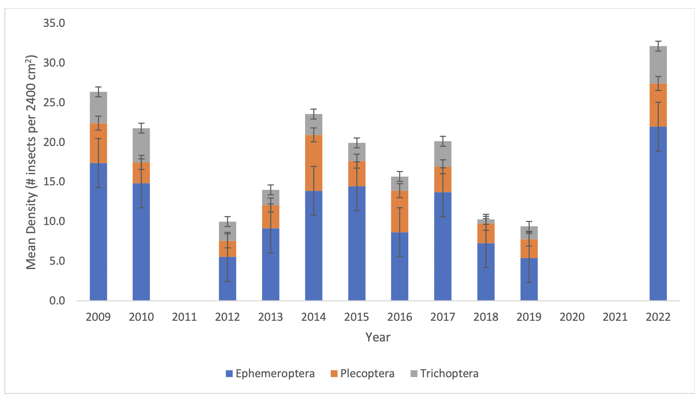
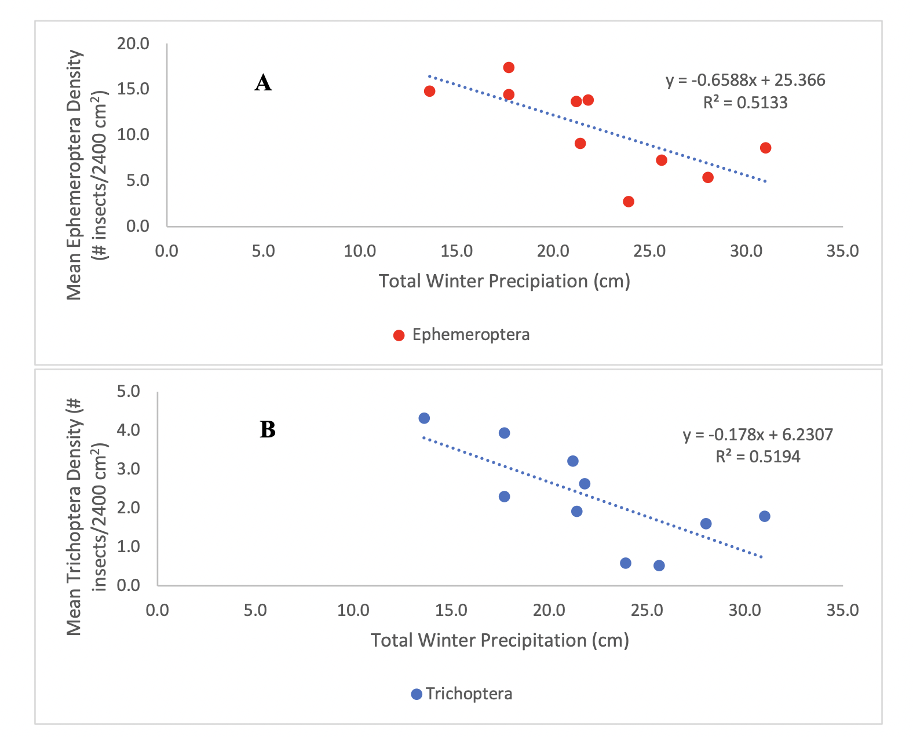

```{r, include=FALSE}
library(tidyverse)
library(ggthemes)
library(ggplot2)
library(ggpubr) # separate package used to add regression equations and R values to ggplot
library(patchwork)
library(plotly)
```

```{r setup, include=FALSE} 
knitr::opts_chunk$set(warning = FALSE, message = FALSE) # hiding any warning messages that pop up on the .html page once knitted (for aesthetics)
```

## Final Assignment 

Overview:

I want to recreate Figures 1 and 2 from my final lab in BIO 140 (Eco/evo). Figure 1 evalutes the mean densities of Ephemeroptera, Plecoptera, and Trichoptera between 2009 and 2022 in Middlebury and New Haven stream research sites (Middlebury,VT). Figure 2 evaluates the effects of winter precipitation on the mean density of Ephemeroptera and Trichoptera (also found in the Middlebury and New Haven stream research sitesbetween 2009 and and 2022. We studied these data as understanding fluctuations in insect density populations is useful when determining overall freshwater stream ecosystem health. 

General steps to recreate the figures below:

1. Arrange data in a way that will make it easily plotable (i.e., condense separate columns with the same information into one column... see troubleshooting)

2. Convert Xcel file into .csv file so it can be loaded by R

3. Load Xcel file into R using read.table()

4. Load desired plot using library(ggplot)

5. Arrange ggplot as desired (follow general annotations below)

**Original Figure 1:**
``` {r, echo=FALSE}

```
Figure 1. Mean densities of Ephemeroptera, Plecoptera, and Trichoptera between 2009 and 2022 in Middlebury and New Haven stream research sites in Vermont. Error bars are ±SE.No samples were collected in 2011, 2020, or 2021.

**My process to recreate Figure 1:**
```{r}
dataF1 <- read.table("BIO1007A_Data/finalData.csv", header=TRUE, sep=",", stringsAsFactors = T) 

plot_F1 <- ggplot(data=dataF1, aes(x=Year, y=Density, fill=Species)) +
  geom_bar(stat="identity", position="identity") +
  geom_errorbar(aes(ymin=Mean-SE, ymax=Mean+SE),width=0.2, #adding error bars. Mean is from mean insect density and SE was calculated in excel and put into a separate column to make it easier to plot
                 position=position_stack(.9)) +
  scale_fill_manual(values=c("dodgerblue4","chocolate1", "grey54")) +
  scale_x_continuous(breaks=seq(2009,2022, by=1)) +
  scale_y_continuous(breaks=seq(0,30, by=5)) +
  ylab("Mean Density (# insects/2400cm^2)") +
  theme_tufte() 
 # theme(legend.postion="bottom") 
plot_F1 
```


**Orignal Figure 2 :**
``` {r, echo=FALSE}

```

Figure 2. Effects of winter precipitation on Ephemeroptera (A) and Trichoptera (B) densities between 2009 and 2022 in Middlebury and New Haven stream research sites in Vermont.

For Figure 2, I wanted to create two figures: one representing the original to the best of my abilities, and the other trying to tidy up the original figure/recreate it in a more visually appealing way.

**My process to recreate Figure 2:**

Option 1 (original):
``` {r}

dataF2 <- read.table("BIO1007A_Data/eeLab_data.csv", header=TRUE, sep=",", stringsAsFactors = TRUE) 

plot_F2_1A <-ggplot(data=dataF2, aes(x=Total.Precipitation.T, y=Trichoptera)) +
  geom_point(size=3, shape=21, color="red", fill="red") +
  geom_smooth(method="lm", se=F, linetype="dashed") +
  
  stat_regline_equation(label.y=15, label.x=27) +
  stat_cor(aes(label=..rr.label..), label.x=27, label.y=14) +
  
  theme_classic() + 
  ylab("Mean Ephemeroptera Density (# insects/2400 cm^2)") +
  xlab("Total Winter Precipitation (cm)") +
  scale_y_continuous(breaks=c(0.0,5.0,10.0,15.0,20.0)) +
  scale_x_continuous(breaks=seq(0.0,35.0, by=5)) +
  annotate("text", x=10, y=15, label="A", fontface=2) +
  theme(axis.title=element_text(size=6)) #changing text size of axes 

plot_F2_1B  <- ggplot(data=dataF2, aes(x=Total.Precipitation.T, y=Trichoptera)) +
  geom_point(size=3, shape=21, color="paleturquoise3", fill="paleturquoise3") +
  geom_smooth(method="lm", se=F, linetype="dashed") +
  
  stat_regline_equation(label.y=15, label.x=27) +
  stat_cor(aes(label=..rr.label..), label.x=27, label.y=14) +
  
  theme_classic() +
  ylab("Mean Density Trichoptera (# insects/2400 cm^2)") +
  xlab("Total Winter Precipitation (cm)") +
 # scale_y_discrete(labels=c("0", "1", "2", "3", "4", "5")) +
  scale_x_continuous(breaks=seq(0.0,35.0, by=5)) +
  annotate("text", x=10, y=15, label="B", fontface=2) +
  theme(axis.title=element_text(size=6)) 


final_plot <- (plot_F2_1A /plot_F2_1B) # using the "patchwork" library to stack the graphs 
final_plot

```


Option 2 (goin' for aesthetics!):
``` {r}
dataF2 <- read.table("BIO1007A_Data/finalData_2.csv", header=TRUE, sep=",", stringsAsFactors = TRUE)

plot_F2_2 <- ggplot(data=dataF2, aes(x=Total.Precipitation, y=Density.2, fill=Species), na.rm=T) +
  geom_point(size=3, shape=21) +
  geom_smooth(method="lm", se=F, linetype="dashed") + # adding regression line
  guides(color = guide_legend(title = "Species")) +
  scale_fill_discrete(breaks=c("Ephemeroptera", "Trichoptera")) + # changing legend name
  
  
  #### Functions below are part of the "ggpubr" package which allows for regression equations to be added         to the figure 
  stat_regline_equation(position=position_stack(), label.y=15, label.x=27) +
  stat_cor(aes(label=..rr.label..), label.x=27, label.y=14, position=position_stack()) +
  annotate("text", x=27, y=17, label="Ephemeroptera", fontface=2) + # labeling regression line and r^2
  annotate("text", x=26.35, y=32, label="Trichoptera", fontface=2) + # labeling regression line and r62
  ####
  
  theme_classic() + 
  ylab("Mean Insect Density (# insects/2400 cm^2)") +
  xlab("Total Winter Precipitation (cm)") +
  scale_y_continuous(breaks=c(0.0,5.0,10.0,15.0,20.0)) +
  scale_x_continuous(breaks=seq(0.0,35.0, by=5)) +
  theme(axis.title=element_text(size=6)) #changing text size of axes 
plot_F2_2
```


**Troubleshooting Tips from a Beginner:**

* Data wrangling:
    + Make sure your data is arranged in such a way that R can read it well. When arranging my data for Figure 1, I had to make 3 columns (Species, Insect Density, Year). This way, I could assign the Year and Density to the x and y axes, respectively, and fill using species. I would not have been able to create Fig.1 if the 3 insect names were arranged in different columns. 
    
* Regression lines:
    + Make sure the "ggpubr" package is installed using install.packages("ggpubr"). This will allow for the use of stat_regline_equation () to be used to make regression lines instead of having to create the lines using a function containing a for loop. 
    
* Axis font size:
    + When using the patchwork library, you may need to adjust the font size of the y axis if vertically stacking figures to prevent axis titles from overlapping. Do this using theme(axis.title=element_text(size=...). 
    
* Proofread!
    + Errors often result from an errant "+" or missing parenthesis. Double check to see if anything small is out of place.
    
* Install new packages
    + If you run into an error and try to seek help from online resources, make sure that you have installed the packages used in the proposed solution. For example, I had to install a new package when looking at tips related to displaying regression lines; I would have saved myself a lot of time if I had realized this sooner. 
    
* Standard error of the mean (SEM):
    + 
    
    
  


