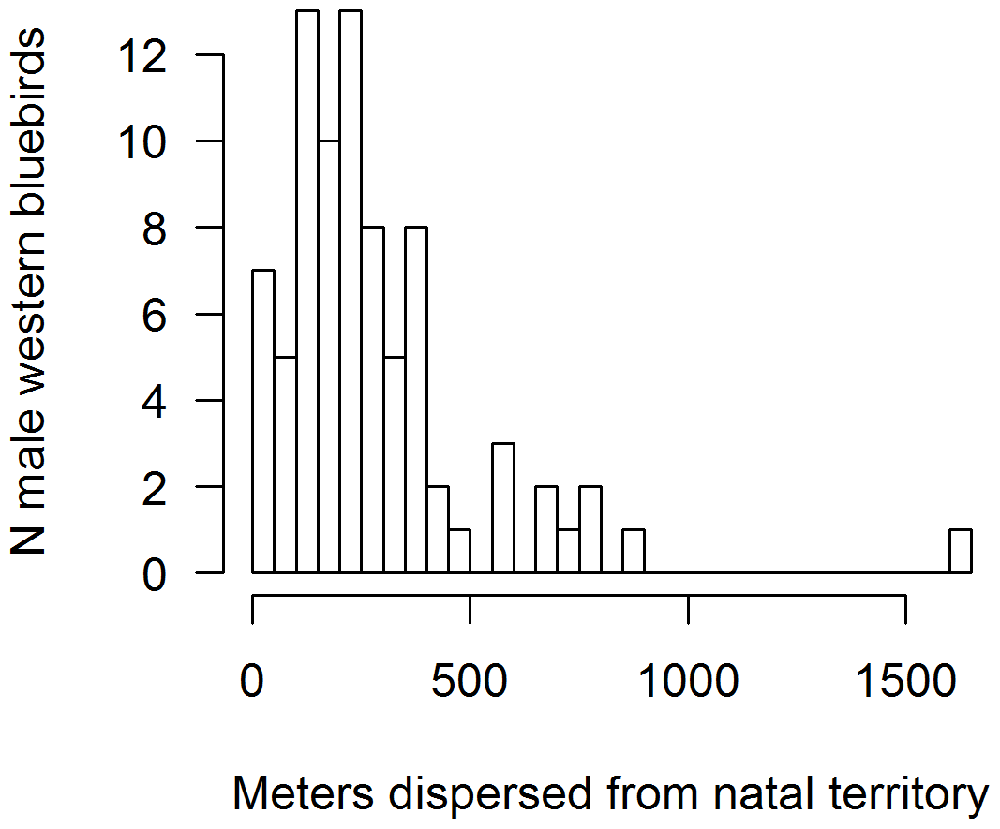

```{r setup, include=FALSE}
knitr::opts_chunk$set(echo = TRUE)
```

```{r, include=FALSE}
library(tidyverse)
library(ggthemes)
library(ggplot2)
```

## Weekly Assignment 3

I am having a lot of trouble with getting the scale right. I don't know how to separate the bins appropriately. I feel like what I've done should work! I specified the scale, and it doesn't show up! Also, the only way to get the shown, custom axis labels to use the hist() function; it doesn't work with ggplot... 

#### Question 1
Go to Dryad to choose a published paper and data set and reconstruct your own figure. Code a ggplot graph that looks as close to the published figure as you can.

###### Chosen paper can be found [here](https://journals.plos.org/plosone/article?id=10.1371/journal.pone.0111947#s3)

###### Dryad data can be found [here](https://datadryad.org/stash/dataset/doi:10.5061/dryad.6475n)

**Desired figure:**
``` {r, echo=FALSE}

```

``` {r}

oak <- read.table("BIO1007A_Data/dispersion_data.csv", header=TRUE, sep=",", stringsAsFactors = TRUE) 


glimpse(oak)
clean_oak <- oak[complete.cases(oak[,2]),] #removing NA's

pOak<- ggplot(data=clean_oak, aes(x=Distance)) +  #creating plot 
  geom_histogram(fill="white", color="black", bins=16, center=10) + #specifying fill color of the bars, bar outline color, # of bars
  ylab("N male western bluebirds") + # labeling axes
  xlab("Meters dispersed from natal territory") +
  scale_y_continuous(breaks = seq(0,12,by=2)) + # scaling axes
  scale_x_continuous(breaks= c(0,500,1000,1500)) +
  theme_classic() + # setting theme 
  theme(axis.line = element_line(colour = "black"), # removing borders (except for axes)
    panel.grid.major = element_blank(),
    panel.grid.minor = element_blank(),
    panel.border = element_blank(),
    panel.background = element_blank()) 

pOak


```
