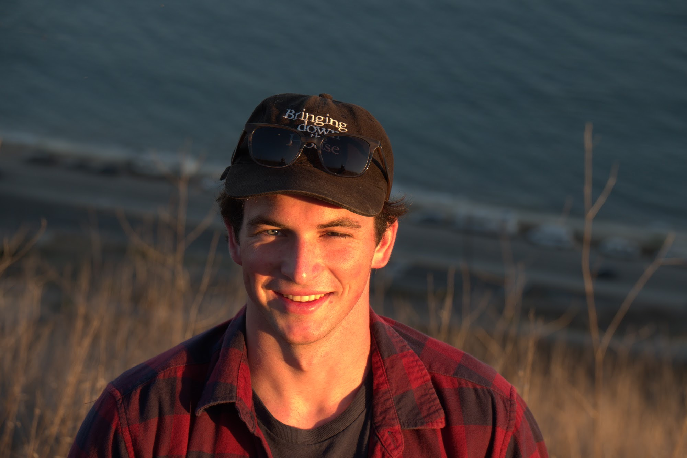

```{r setup, include=FALSE}
knitr::opts_chunk$set(echo = TRUE)
```

``` {r, echo=FALSE}

```

Hello, and welcome to my BIO1007 webpage! My name is Andrew, and I am Molecular Biology & Biochemistry major at Middlebury College. This is my wepbage for my January-Term winter class, "Reproducible Biology in R". Here, you will find my daily assignments as well as my weekly assignments. 

#### Daily Assignments

[Assignment 1](Assignment1.html)

[Assignment 2](Assignment2.html)

[Assignment 3](Assignment3.html)

[Assignments 4 & 5](Assignment4_5.html)

[Assignment 6](Assignment6.html)

[Assignment 7](Assignment7.html)

[Assignment 8](Assignment8.html)

[Assignment 9](Assignment9.html)

#### Weekly Assignments
[Weekly Assignment 1](WeeklyAssignment.html)

[Weekly Assignment 2](WeeklyAssignment2.html)

[Weekly Assignment 3](WeeklyAssignment3.html)

[Weekly Assignment 4](WeeklyAssignment4.html)

#### Final Assignment 
[Final Assignment](FinalAssignment.html)
